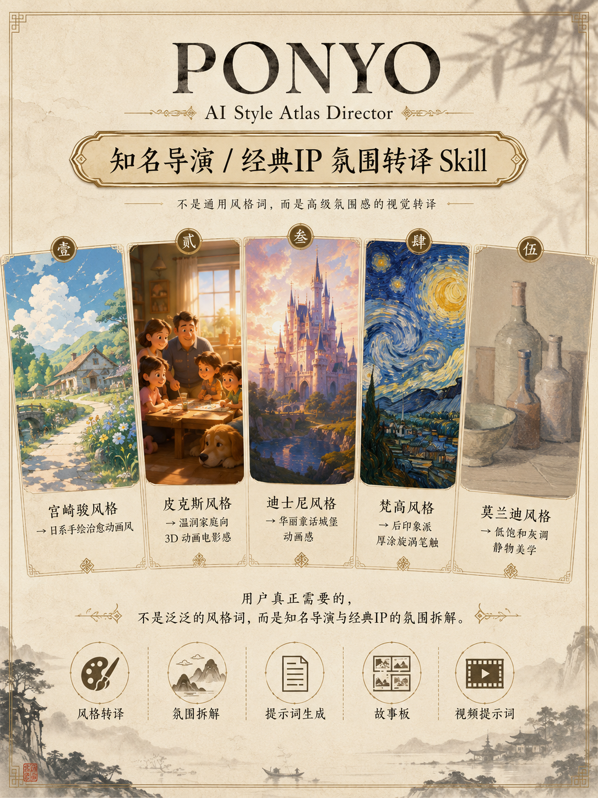
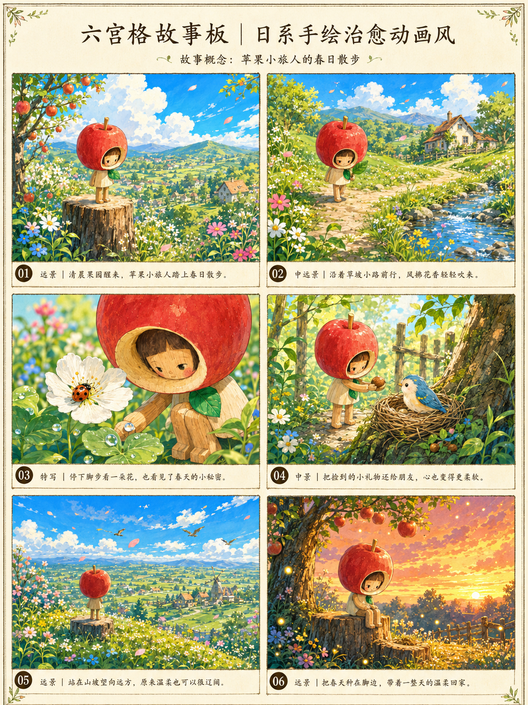
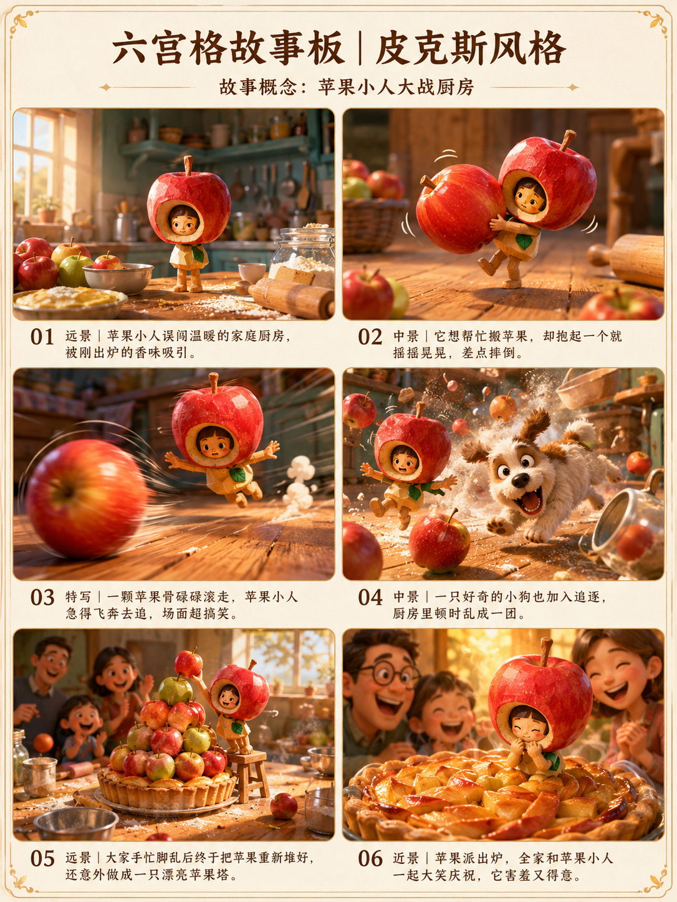
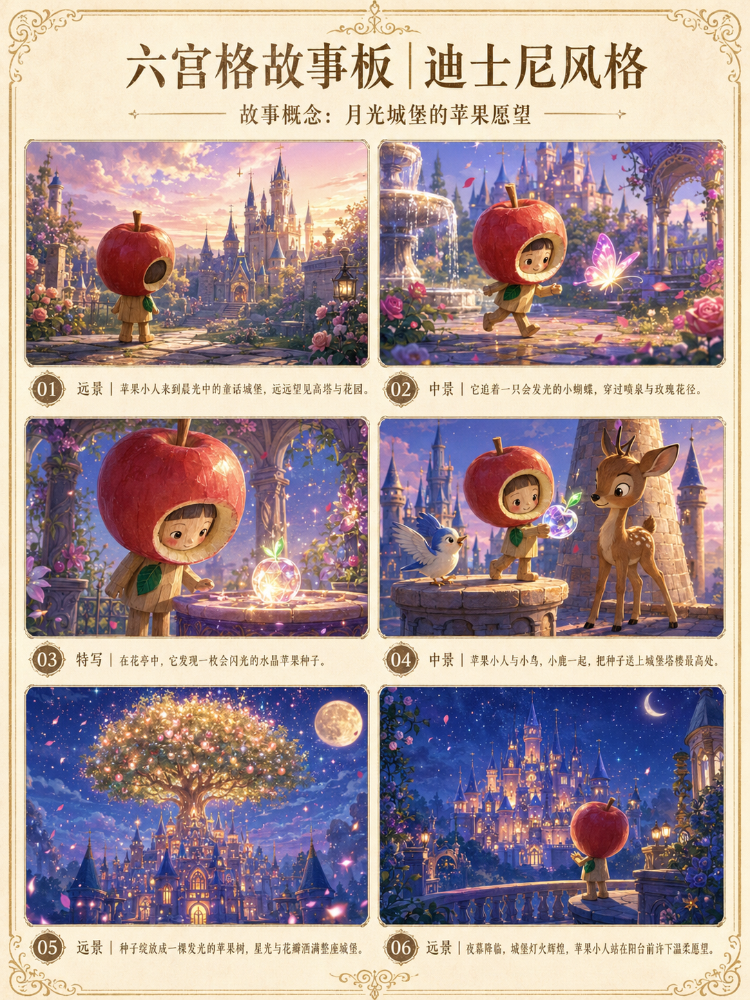

# PONYO AI Style Atlas Director Skill

中文名：**AI 艺术风格导演图谱 Skill**  
当前版本：**V3.1 — 双引擎编译（ChatGPT Imagen 2 × NanoBanana2）× 视频模型路由 × 风格锚导出版**



## 快速入口

- Skill 源码：[`SKILL.md`](SKILL.md)
- 可下载 Skill 包：[`dist/ponyo-ai-style-atlas-director-v3.1.skill`](dist/ponyo-ai-style-atlas-director-v3.1.skill)
- 风格分类：[`STYLE_TAXONOMY.md`](STYLE_TAXONOMY.md)
- 示例目录：[`examples/`](examples/)

## 配图展示

| Skill 介绍海报 | 日系手绘治愈动画风 |
|---|---|
|  |  |

| 温润家庭向 3D 动画电影感 | 华丽童话城堡动画感 |
|---|---|
|  |  |

这个项目最初来自“AI 艺术风格图谱”，但 V2 已经不再定位为普通风格关键词库。它的核心价值是：

> 把用户熟悉的动画、艺术和视觉氛围，转译成可执行、可商用、更安全的视觉风格 DNA、提示词、故事板和视频提示词。

## V3 核心变化

在 V2「氛围转译」之上，打通三个生产断层：

1. **双引擎编译**：同一份视觉 DNA，ChatGPT Imagen 2（对话迭代）和 NanoBanana2（叙述式）各出一版，不再一份提示词喂所有引擎。
2. **视频模型路由**：15 秒提示词按即梦/Seedance/可灵/Veo/万相的模型方言输出，继承三条铁律（30–100 词长度纪律、一事一提示词、图生视频只写运动+运镜）。
3. **风格锚导出**：任意转译成果可导出为 prism-style-anchor 五维锚卡，跨项目"换皮不换骨"。

完整链路：

```text
传播版名称 → 商用安全转译 → 视觉 DNA → 双引擎图片提示词 → 模型路由视频提示词 → 风格锚卡 → 引擎级质检
```

## V2 核心变化

### 从“通用风格”升级为“氛围转译”

普通用户自己就能写：电影感、商业摄影、新中式、治愈动画、未来主义。  
真正有价值的是帮助用户理解：

- 宫崎骏氛围为什么不像普通日漫？
- 皮克斯式家庭向 3D 为什么不是普通 3D 卡通？
- 迪士尼童话城堡为什么不是普通梦幻城堡？
- 梵高式厚涂为什么不是随便加旋涡？
- 莫兰迪色调为什么不是简单降低饱和度？

Skill 的作用是做这件事：

```text
传播版名称 → 商用安全版转译 → 视觉 DNA → 图片提示词 → 故事板 → 视频提示词 → 质检标准
```

## 必备转译示例

| 传播版名称 | 商用安全版转译 |
|---|---|
| 宫崎骏风格 / 吉卜力风格 | 日系手绘治愈动画风 |
| 皮克斯风格 | 温润家庭向 3D 动画电影感 |
| 迪士尼风格 | 华丽童话城堡动画感 |
| 梵高风格 | 后印象派厚涂旋涡笔触 |
| 莫兰迪风格 | 低饱和灰调静物美学 |

## 文件结构

```text
ponyo-ai-style-atlas-skill/
├── SKILL.md
├── README.md
├── STYLE_TAXONOMY.md
├── CHANGELOG.md
├── data/
│   ├── director_ip_atmosphere.yaml
│   ├── commercial_safe_aliases.yaml
│   ├── core_styles.yaml
│   └── extended_styles.yaml
├── templates/
│   ├── director_ip_translation_template.md
│   ├── image_prompt_template.md
│   ├── storyboard_template.md
│   ├── video_15s_template.md
│   ├── cover_template.md
│   └── quality_check_template.md
├── examples/
│   ├── director_ip_atmosphere_poster_example.md
│   ├── director_ip_storyboard_example.md
│   ├── prompt_conversion_examples.md
│   ├── medical_brand_example.md
│   ├── intangible_heritage_example.md
│   ├── xiaohongshu_cover_example.md
│   └── toy_ip_example.md
└── assets/
    └── posters/
        └── ai-style-atlas-overview.png
```

## 推荐用法

把 `SKILL.md` 作为主 Skill 文件。  
`data/director_ip_atmosphere.yaml` 是 V2 的核心风格库。  
`commercial_safe_aliases.yaml` 用于把传播版名称转成更安全的提示词语言。  
`templates/` 用于固定输出结构。  
`examples/` 用于测试 Skill 是否真的能输出明确的视觉氛围，而不是通用风格。

## 一句话定位

> 这不是一个“AI 风格关键词表”，而是一个把熟悉的视觉氛围拆解成视觉 DNA、提示词、故事板和视频镜头的 AI 风格导演 Skill。
